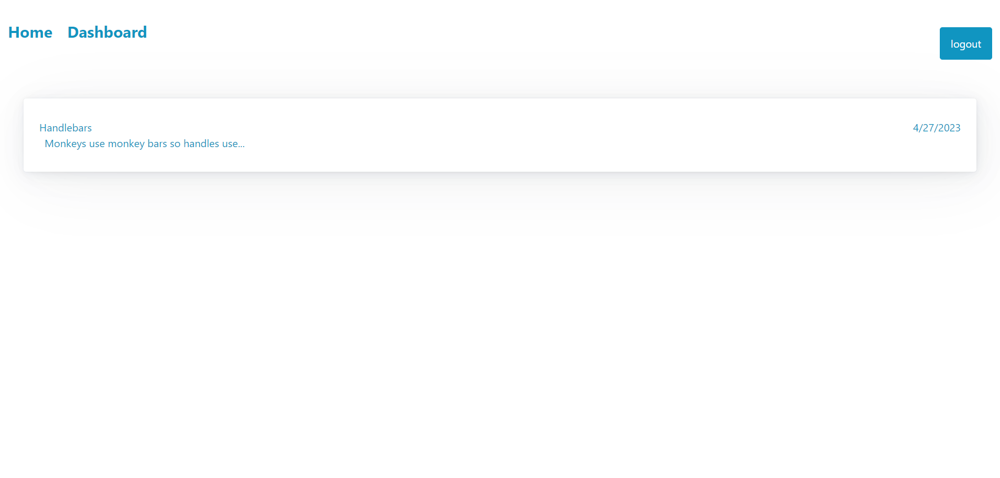

# tech-thoughts

## Description
An application which allows users to create update and delete posts and uses Node.js, sequelize.js, express.js and mysql. This takes advantage of front-end to back-end management through MVC architecture.

## Assets
Here is a link to the Github Repository [link](https://github.com/jgerona/tech-thoughts)

You can use this [Link](https://arcane-dusk-25099.herokuapp.com/) to access the page.

Here is an image of the deployed site 